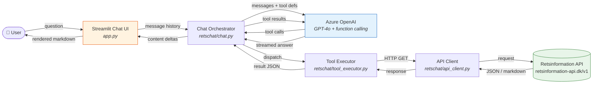
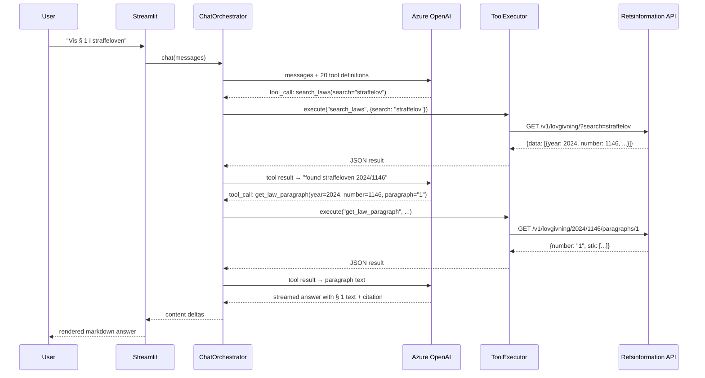

# ⚖️ RetsChat

A conversational AI interface for Danish legislation. Ask questions about laws, bills, and parliamentary proceedings in natural language — RetsChat looks up real-time data from [retsinformation.dk](https://retsinformation-api.dk) and answers with proper legal references.

Built with **Streamlit**, **Azure OpenAI** (function calling), and the public **Retsinformation API**.

## Quick Start

```bash
# 1. Install
pip install -e .

# 2. Configure Azure OpenAI
cp .env.example .env
# Edit .env with your credentials (see Configuration below)

# 3. Run
streamlit run app.py
```

The app opens at `http://localhost:8501`. Type a question or click one of the example prompts in the sidebar.

## What Can It Do?

| Capability                                    | Example question                                             |
| --------------------------------------------- | ------------------------------------------------------------ |
| **Search laws** by topic, year, ministry      | _"Søg efter love om sundhed"_                                |
| **Read law text** — full or specific §/stk.   | _"Vis § 15 i straffeloven"_                                  |
| **Version history & diffs**                   | _"Hvad ændrede sig mellem version 1 og 3 af lov 2017/1002?"_ |
| **Law at a point in time**                    | _"Vis loven som den så ud 1. januar 2020"_                   |
| **Legislative bills** (Lovforslag)            | _"Hvilke lovforslag er vedtaget i 2025?"_                    |
| **Bill lifecycle & actors**                   | _"Hvem fremsatte L 83 og hvad var processen?"_               |
| **Parliamentary cases** (all 13 types)        | _"Find beslutningsforslag om klima"_                         |
| **Actors** — politicians, committees, parties | _"Hvilke udvalg sidder Mette Frederiksen i?"_                |
| **Keywords & topics**                         | _"Find sager med emneord 'digitalisering'"_                  |
| **Parliamentary periods**                     | _"Hvad er den aktuelle folketingssamling?"_                  |

Answers are streamed in real time with live status indicators when API lookups happen.

## Architecture



### How the Tool-Calling Loop Works



The LLM can chain up to **6 sequential tool calls** per turn (configurable via `MAX_TOOL_ROUNDS`), allowing it to search first, then drill into specifics — just like a human would.

## Project Structure

```
retschat/
├── app.py                    # Streamlit entrypoint — chat UI, sidebar, session state
├── pyproject.toml            # Dependencies & project metadata
├── .env.example              # Template for Azure OpenAI credentials
└── retschat/
    ├── config.py             # Pydantic settings loaded from .env
    ├── api_client.py         # HTTP client wrapping all Retsinformation API endpoints
    ├── tools.py              # 20 curated function-calling tool definitions
    ├── tool_executor.py      # Maps tool names → API client methods, handles truncation
    └── chat.py               # Azure OpenAI orchestration (streaming + tool loop)
```

### Key Design Decisions

- **20 curated tools** (not 40+ raw endpoints) — reduces LLM confusion and improves tool selection accuracy. Related endpoints are combined (e.g. original/latest/at-date markdown are one `get_law_text` tool with a `version` parameter).
- **Markdown endpoints preferred** for law text — gives the LLM readable content to summarize rather than deeply nested JSON structures.
- **Response truncation** at the tool-executor level (default 12,000 chars) — prevents token budget blowouts on large law texts. The truncation message tells the user to ask for specific paragraphs.
- **No database** — the app is stateless (aside from Streamlit session state). All data comes from the Retsinformation API in real time.
- **No LangChain** — direct Azure OpenAI SDK with function calling keeps the stack simple and debuggable.

## Configuration

Copy `.env.example` to `.env` and set:

| Variable                   | Description                    | Default              |
| -------------------------- | ------------------------------ | -------------------- |
| `AZURE_OPENAI_ENDPOINT`    | Your Azure OpenAI resource URL | _(required)_         |
| `AZURE_OPENAI_API_KEY`     | API key                        | _(required)_         |
| `AZURE_OPENAI_DEPLOYMENT`  | Deployment/model name          | `gpt-4o`             |
| `AZURE_OPENAI_API_VERSION` | API version                    | `2024-12-01-preview` |

Optional tuning (set in `.env` or leave defaults):

| Variable                  | Description                        | Default |
| ------------------------- | ---------------------------------- | ------- |
| `TEMPERATURE`             | LLM temperature (0–1)              | `0.3`   |
| `MAX_TOKENS`              | Max response tokens                | `4096`  |
| `MAX_TOOL_ROUNDS`         | Max sequential tool calls per turn | `6`     |
| `MAX_TOOL_RESPONSE_CHARS` | Truncation limit for tool results  | `12000` |

## API Coverage

RetsChat covers the full [Retsinformation API](https://retsinformation-api.dk/docs):

| API Group    | Endpoints    | What's available                                                                                   |
| ------------ | ------------ | -------------------------------------------------------------------------------------------------- |
| **Laws**     | 18 endpoints | Search, full text (markdown), paragraphs, versions, diffs, amendments, legislative history, actors |
| **Bills**    | 12 endpoints | Search, details, text content, lifecycle steps, actors, documents, keywords, enacted law           |
| **Cases**    | 10 endpoints | Search all 13 case types, steps, actors, documents, keywords, text                                 |
| **Actors**   | 5 endpoints  | Search by name/type, details, memberships, relationships                                           |
| **Keywords** | 3 endpoints  | Search topics, find cases by keyword                                                               |
| **Periods**  | 3 endpoints  | List periods, current period, lookup by ID                                                         |

## Disclaimer

RetsChat is **not legal advice**. Always verify information against the official texts at [retsinformation.dk](https://www.retsinformation.dk).

## License

MIT
